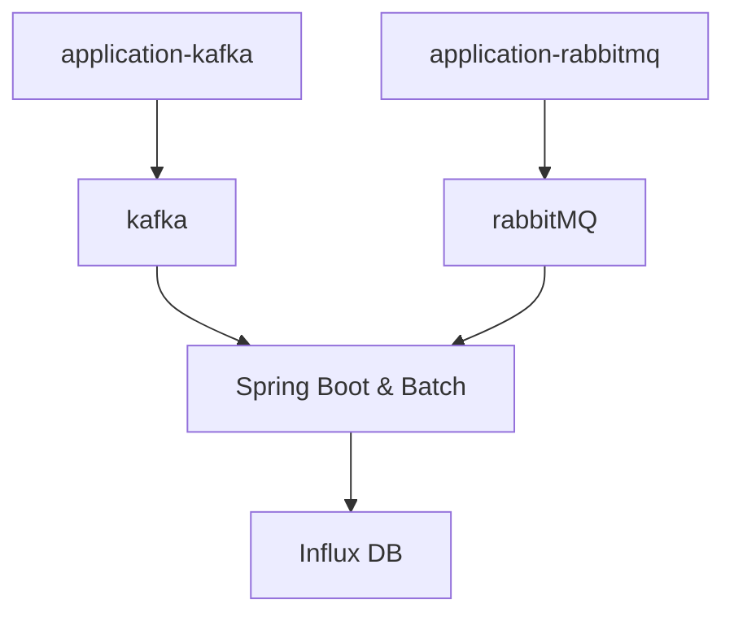

# influx-db-test
influxDB - Java Connect 테스트

```mermaid
flowchart TD
    K[application-kafka] --> A[kafka]
    K2[application-rabbitmq] --> R[rabbitMQ]
    A[kafka] --> B[Spring Boot]
    R[rabbitMQ] --> B[Spring Boot]
    B[Spring Boot & Batch] --> C[Influx DB]
  
```

원래는 RabbitMQ를 쓰기로했는데 까먹고 kafka도 연결했고 아까워서 그냥 삭제하지 않고 코드에 냄겨둠.. 참고용으로
